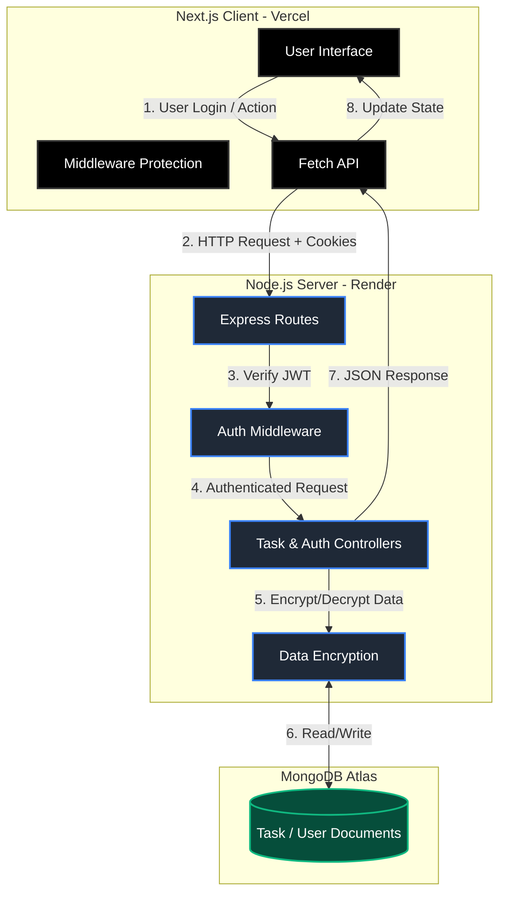

# TaskBoard Pro 🚀

A premium full-stack task management application built with **Next.js 15**, **Express**, and **MongoDB**. Features a high-end "Glassmorphism" UI, secure authentication, and real-time task tracking.

### 🔗 Live Links
- **Frontend (Vercel)**: [https://task-board-delta-five.vercel.app](https://task-board-delta-five.vercel.app)
- **Backend API (Render)**: [https://taskboard-server-ru97.onrender.com](https://taskboard-server-ru97.onrender.com)

## ✨ Features

- **Premium UI/UX**: Modern glassmorphism design with Tailwind CSS v4, mesh backgrounds, and smooth animations.
- **Secure Authentication**: JWT-based auth with secure HTTP-only cookies and route protection.
- **Task Management**: Full CRUD operations with search, status filtering, and pagination.
- **Data Security**: Sensitive task data is encrypted on the server using AES before transmission.
- **Responsive Design**: Fully optimized for desktop and mobile devices.

## 🛠️ Tech Stack

### Frontend
- **Framework**: Next.js 15 (App Router)
- **Styling**: Tailwind CSS v4
- **Icons**: Lucide React
- **Animations**: Framer Motion / CSS Keyframes

### Backend
- **Runtime**: Node.js
- **Framework**: Express.js
- **Database**: MongoDB (Mongoose)
- **Validation**: Zod
- **Security**: JWT, BcryptJS, CryptoJS, Cookie-Parser

## 🏗️ System Architecture & Workflow



## 🚀 Getting Started

### Prerequisites
- Node.js (v18+)
- MongoDB Atlas account or local instance

### Installation

1. **Clone the repository**
   ```bash
   git clone https://github.com/ShreyashPatil530/TaskBoard.git
   cd TaskBoard
   ```

2. **Setup Server**
   ```bash
   cd server
   npm install
   ```
   Create a `.env` file in the `server` directory:
   ```env
   MONGODB_URI=your_mongodb_uri
   JWT_SECRET=your_jwt_secret
   ENCRYPTION_KEY=your_aes_32_char_key
   PORT=5000
   NODE_ENV=development
   ```

3. **Setup Client**
   ```bash
   cd ../client
   npm install
   ```
   Create a `.env.local` file in the `client` directory:
   ```env
   NEXT_PUBLIC_API_URL=http://localhost:5000/api
   ```

### Running Locally

From the root directory, run:
```bash
npm run dev
```
- Frontend: `http://localhost:3000`
- Backend: `http://localhost:5000`

## ☁️ Deployment

### Backend (Render)
- **Build Command**: `npm install && npm run build`
- **Start Command**: `npm start`
- **Environment**: Set `NODE_ENV=production` and `FRONTEND_URL=your_deployed_frontend_url`.

### Frontend (Vercel)
- **Framework Preset**: Next.js
- **Environment**: Set `NEXT_PUBLIC_API_URL=your_deployed_backend_api_url`.

## 📄 License
This project is licensed under the MIT License.
